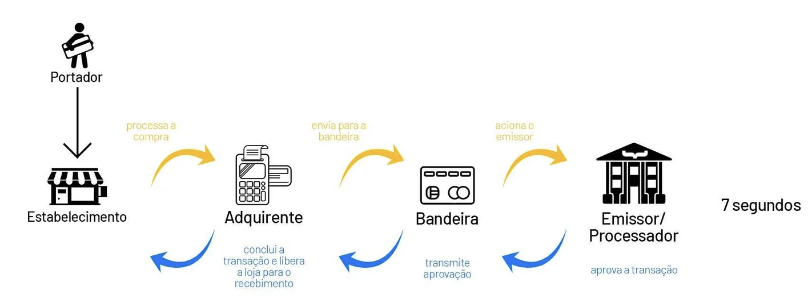

# Players no Mundo da Adquirência

## Descrição

Este documento descreve os diferentes players envolvidos no mundo da adquirência, suas funções e como eles trabalham juntos para facilitar transações financeiras com cartões de crédito/débito.

## Players

1. **Adquirente:**
   - **Papel:** Responsável por processar transações em nome do comerciante, conectar-se aos bancos emissores das bandeiras de cartão e cobrar taxas pelo processamento das transações.

2. **Bandeira do Cartão:**
   - **Papel:** Estabelece redes de pagamento, define regras e regulamentos para o uso de cartões e fornece suporte de marca e marketing.

3. **Banco Emissor:**
   - **Papel:** Emite cartões de crédito/débito, concede crédito, gerencia contas e verifica e autoriza transações.

4. **Subadquirente:**
   - **Papel:** Atua como intermediária entre o comerciante e a adquirente, assumindo o risco das transações e oferecendo serviços de adquirência.

5. **Gateway de Pagamento:**
   - **Papel:** Facilita a comunicação entre o comerciante e os sistemas de adquirentes/bancos emissores, criptografando e transmitindo dados de transação de forma segura.

6. **Cliente Final:**
   - **Papel:** Realiza a compra utilizando um cartão de crédito/débito e é o beneficiário dos produtos ou serviços adquiridos.

7. **Portador do Cartão:**
   - **Papel:** Possui o cartão e fornece os detalhes para autorizar a transação.

## Fluxo de Informação

(imagem da Bankly.com.br)

Este fluxo descreve como a informação flui entre os diferentes players durante uma transação.

    Transação do Cliente:
        O cliente realiza uma transação utilizando um cartão de crédito/débito.

    Terminal de Pagamento:
        As informações do cartão e da transação são capturadas pelo terminal de pagamento.

    Envio para a Adquirente:
        O terminal envia os dados da transação para a adquirente.

    Processamento pela Adquirente:
        A adquirente processa os dados da transação, autentica o cartão e verifica a disponibilidade de fundos.

    Solicitação de Autorização para a Bandeira:
        A adquirente encaminha uma solicitação de autorização para a bandeira do cartão.

    Encaminhamento para o Banco Emissor:
        A bandeira do cartão encaminha a solicitação de autorização para o banco emissor do cartão.

    Decisão do Banco Emissor:
        O banco emissor verifica se há fundos suficientes e se a transação é válida. Ele responde à bandeira com uma autorização ou recusa.

    Resposta para a Adquirente:
        A bandeira do cartão envia a resposta de autorização ou recusa para a adquirente.

    Retorno para o Terminal:
        A adquirente envia a resposta da transação de volta para o terminal de pagamento.

    Feedback para o Cliente:
        O terminal fornece feedback ao cliente, indicando se a transação foi aprovada ou recusada.

## Fluxo de Dinheiro

Este fluxo descreve como o dinheiro flui entre os diferentes players durante uma transação.

    Transação do Cliente:
        O cliente realiza uma compra usando um cartão de crédito/débito.

    Terminal de Pagamento:
        As informações da transação são capturadas pelo terminal.

    Envio para a Adquirente:
        O terminal envia os dados da transação para a adquirente.

    Processamento pela Adquirente:
        A adquirente processa a transação e verifica a disponibilidade de fundos.

    Solicitação de Autorização e Liquidação para a Bandeira:
        Se a transação for autorizada, a adquirente solicita a liquidação do valor da transação à bandeira do cartão.

    Encaminhamento para o Banco Emissor:
        A bandeira do cartão encaminha a solicitação de liquidação para o banco emissor do cartão.

    Pagamento ao Banco Emissor:
        O banco emissor recebe o valor da transação da adquirente através da bandeira do cartão.

    Transferência para o Comerciante:
        O banco emissor transfere o valor da transação para a conta bancária do comerciante.

    Taxas de Interchange:
        Durante o processo de liquidação, ocorre a cobrança de taxas de interchange, que são pagas pela adquirente para a bandeira do cartão e pelo banco emissor.

    Taxas de Serviço:
        A adquirente pode cobrar taxas de serviço do comerciante pelo processamento das transações.

## Diferença entre Adquirente, Subadquirente e Gateway de Pagamento

    Adquirente:
        A adquirente é uma instituição financeira responsável por processar transações com cartões de crédito/débito em nome do comerciante. Ela se conecta aos bancos emissores das bandeiras de cartão para autorizar as transações e facilitar a liquidação financeira. A adquirente cobra taxas do comerciante pelo processamento das transações.

    Subadquirente:
        Um subadquirente é uma empresa que atua como intermediária entre o comerciante e a adquirente. Ela realiza o processo de subaquisição, onde assume o risco das transações realizadas pelos comerciantes. O subadquirente geralmente oferece serviços de adquirência para comerciantes que não podem ou não querem estabelecer uma relação direta com uma adquirente.

    Gateway de Pagamento:
        Um gateway de pagamento é uma plataforma tecnológica que facilita a comunicação entre o site ou sistema do comerciante e os sistemas das adquirentes e/ou bancos emissores. Ele criptografa e transmite os dados da transação de forma segura, além de oferecer funcionalidades como processamento de pagamentos recorrentes, tokenização de cartões e gestão de fraudes.

Fluxo de Informação com Adquirente, Subadquirente e Gateway de Pagamento:

    Transação do Cliente:
        O cliente realiza uma transação no site do comerciante.

    Gateway de Pagamento:
        O gateway de pagamento recebe os dados da transação do cliente de forma segura e os encaminha para o subadquirente ou para a adquirente, dependendo da configuração do sistema.

    Subadquirente (ou Adquirente):
        O subadquirente recebe os dados da transação do gateway e os encaminha para a adquirente, ou a adquirente recebe diretamente os dados da transação do gateway.

    Processamento pela Adquirente:
        A adquirente processa os dados da transação, autentica o cartão e verifica a disponibilidade de fundos.

    Solicitação de Autorização para a Bandeira:
        A adquirente encaminha uma solicitação de autorização para a bandeira do cartão.

    Decisão do Banco Emissor:
        O banco emissor verifica se há fundos suficientes e se a transação é válida. Ele responde à bandeira com uma autorização ou recusa.

    Resposta para a Adquirente:
        A bandeira do cartão envia a resposta de autorização ou recusa para a adquirente.

    Retorno para o Gateway de Pagamento:
        A adquirente envia a resposta da transação de volta para o gateway de pagamento.

    Feedback para o Cliente:
        O gateway de pagamento fornece feedback ao site do comerciante, indicando se a transação foi aprovada ou recusada.

## Entendendo Chargebacks no Mundo da Adquirência

Chargebacks são um mecanismo no sistema financeiro que permite a um titular de cartão contestar uma transação e solicitar um reembolso ao emissor do cartão. Chargebacks podem ocorrer por diversos motivos, incluindo:

    Transações Fraudulentas: Se um titular de cartão identifica cobranças não autorizadas em sua conta, ele pode iniciar um chargeback para recuperar seus fundos.

    Disputas sobre Bens ou Serviços: Se um titular de cartão está insatisfeito com uma compra (por exemplo, recebeu mercadorias danificadas, não recebeu o produto/serviço conforme prometido), ele pode solicitar um chargeback.

    Erros de Processamento: Instâncias em que a transação foi processada incorretamente, como cobranças duplicadas ou valores incorretos faturados.

Diferenças em relação a Cancelamentos:

    Cancelamentos: Geralmente iniciados pelo comerciante, cancelamentos ocorrem antes que a transação seja finalizada. Eles podem acontecer por diversos motivos, como o cliente mudar de ideia, indisponibilidade do produto ou término do acordo antes da conclusão da transação. Cancelamentos geralmente não têm impacto financeiro ou resultam em um reembolso emitido diretamente pelo comerciante.

    Chargebacks: Iniciados pelo titular do cartão, chargebacks ocorrem após a transação ser concluída e aparecem como um débito na conta do comerciante. Ao contrário dos cancelamentos, os chargebacks envolvem o emissor do cartão e podem resultar na reversão de fundos da conta do comerciante para a conta do titular do cartão. Chargebacks frequentemente incorrem em taxas adicionais para o comerciante, e chargebacks excessivos podem levar a penalidades ou perda de privilégios de comerciante.

Conexão com Fraude no Mundo da Adquirência:

Chargebacks estão ligados à fraude no mundo da adquirência por diversos motivos:

    Transações Fraudulentas: Chargebacks são comumente usados para contestar transações que são resultado de fraude, como uso não autorizado de informações de cartão roubadas ou roubo de identidade. Transações fraudulentas podem resultar em perdas financeiras tanto para titulares de cartão quanto para comerciantes.

    Alegações de Chargeback Fraudulentas: Em alguns casos, fraudadores podem fazer compras intencionalmente com o objetivo de posteriormente contestar as transações por meio de chargebacks, obtendo efetivamente bens ou serviços sem pagar por eles. Isso é conhecido como "fraude amigável" ou "fraude de chargeback" e representa um desafio significativo para comerciantes e processadores de pagamento.

    Medidas de Prevenção de Fraude: Adquirentes e processadores de pagamento implementam diversas medidas de prevenção de fraude, como algoritmos de detecção de fraude, sistemas de verificação de endereço e protocolos 3D Secure, para mitigar o risco de transações fraudulentas e chargebacks. Essas medidas visam proteger tanto comerciantes quanto titulares de cartão de perdas financeiras associadas à fraude.

## Fontes

- Conhecimento prévio por trabalhar em fintech subadquirente
- [Cora - O que são adquirentes?](https://www.cora.com.br/blog/o-que-sao-adquirentes/)
- [Concil - O que é subadquirente?](https://www.concil.com.br/blog/o-que-e-subadquirente/)
- [Pagar.me - Subadquirente e adquirente: o que você precisa saber](https://pagar.me/blog/subadquirente-e-adquirente-o-que-voce-precisa-saber/)
- [PagSeguro - O que é adquirente e subadquirente?](https://blog.pagseguro.uol.com.br/o-que-e-adquirente-e-subadquirente/)
- [Pagar.me - Adquirencia](https://pagar.me/blog/adquirencia/)
- [Bankly - Saiba como funciona o fluxo de uma transação de pagamento](https://blog.bankly.com.br/saiba-como-funciona-o-fluxo-de-uma-transacao-de-pagamento-0-0)
- ChatGPT (com double check nas informações para não confiar em alucinações do modelo)

Todos acessados em: 15/04/2024
