# Análise com Pandas - Ferramenta de Análise de Dados

## Índice
- [Introdução](#introdução)
- [Fontes de Conhecimento Utilizadas](#fontes-de-conhecimento-utilizadas)
- [Resumo dos Dados](#resumo-dos-dados)
  - [Análise Inicial](#análise-inicial)
  - [Análise Básica](#análise-básica)
  - [Distribuição Temporal e de Valores](#distribuição-temporal-e-de-valores)
  - [Estatísticas de Transações](#estatísticas-de-transações)
  - [Análise de Usuários e Comerciantes](#análise-de-usuários-e-comerciantes)
  - [Distribuição de Chargeback ao Longo do Tempo](#distribuição-de-chargeback-ao-longo-do-tempo)
  - [Distribuição de Chargeback por Hora do Dia](#distribuição-de-chargeback-por-hora-do-dia)
  - [Análise de Dispositivos](#análise-de-dispositivos)
  - [Análise de Números de Cartão](#análise-de-números-de-cartão)
  - [Conclusão](#conclusão)
- [Bônus: Algoritmos de Machine Learning](#bônus-algoritmos-de-machine-learning)
- [Outros Dados Potenciais para Enriquecimento da Análise](#outros-dados-potenciais-para-enriquecimento-da-análise)

## Introdução
Pandas é uma biblioteca de código aberto que fornece estruturas de dados de alto desempenho e fácil de usar, bem como ferramentas de análise de dados para a linguagem de programação Python.

Com a lib e o CSV de fraude, vamos fazer algumas analises encima dos dados.

Obs: O código utilizado está na pasta ./code , porém não é necessário rodar caso não queira, basta olhar as imagens geradas neste README.

Caso queira rodar os codigos, instale as dependências
pandas
matplotlib
scikit-learn

## Resumo dos Dados

### Análise Inicial
Arquivo: `1.py` - Imprime as primeiras linhas para verificar a configuração correta do ambiente.

### Análise Básica
Arquivo: `2.py` - Análise de dados faltantes e estatísticas descritivas:
- Total de 3200 transações.
- Valores variando entre $1.22 e $4097.21, com uma média de $767.66.
- IDs variados, indicando uma amostra diversificada.
- O campo 'device_id' possui 831 entradas faltantes.

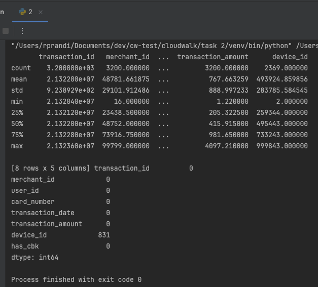

### Distribuição Temporal e de Valores
Arquivo: `3.py` - Visualização da distribuição das transações ao longo do tempo e análise de dispersão dos valores.

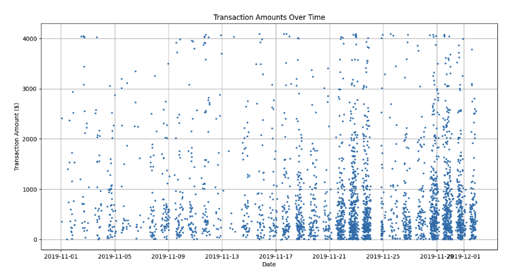

Cada ponto representa uma transação. A quantidade de transações está bem distribuída ao longo do tempo, com a maioria dos valores sendo menores.

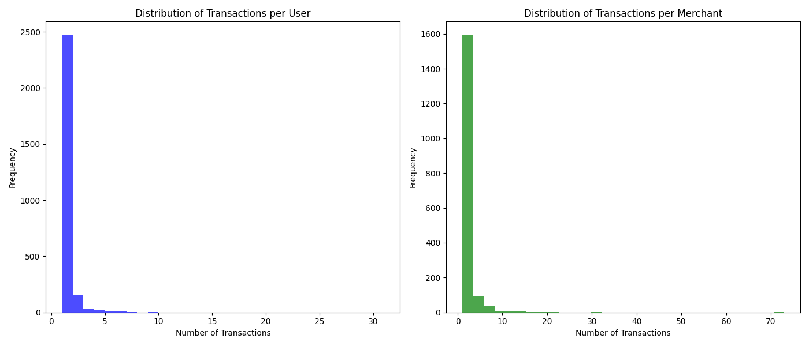

#### Clientes

A maioria dos clientes possui um número relativamente baixo de transações, com poucos outliers com muitas transações.

#### Comerciantes

Padrão similar ao dos clientes.

### Estatísticas de Transações
Arquivo: `4.py` - Dados sobre transações com e sem chargeback destacando a correlação entre valor alto e maior risco de disputa.

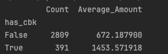

- Transações sem chargeback: 2809, com média de $672.19.
- Transações com chargeback: 391, com média de $1453.57.

Aqui encontramos um dado interessante: quanto maior o valor da transação, maior a chance de disputa.

### Análise de Usuários e Comerciantes
Arquivo: `5.py` - Perfil dos usuários e comerciantes relacionados a chargebacks, identificando padrões de comportamento suspeitos.

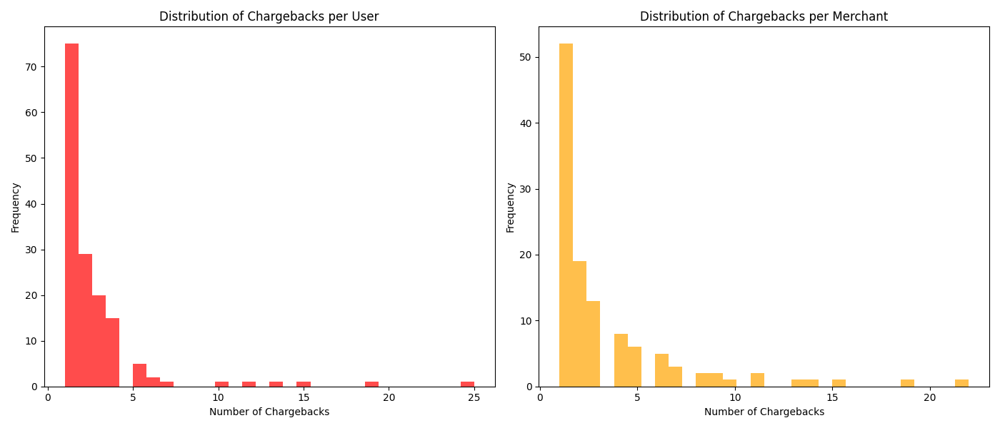

#### Usuários

A maioria dos usuários associados a chargeback possui poucas instâncias, sugerindo casos isolados. Alguns usuários têm mais instâncias, o que pode sugerir falta de confiança no serviço, intenções maliciosas ou vulnerabilidade a fraudes.

#### Comerciantes

Padrão similar ao dos usuários. Para comerciantes com mais chargebacks, pode-se considerar ações para aumentar a segurança ou melhorar a satisfação do cliente.

### Distribuição de Chargeback ao Longo do Tempo
Arquivo: `6.py` - Análise temporal dos chargebacks em relação ao valor das transações.

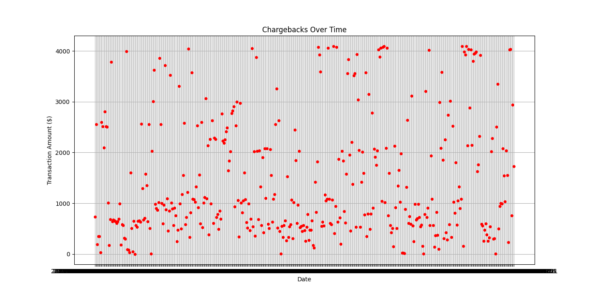

Aqui podemos ver a distribuição de chargebacks em relação ao tempo e ao valor das transações. Não parece haver padrões claros, com alguns outliers de valores altos, mas nada que se destaque.

### Distribuição de Chargeback por Hora do Dia
Arquivo: `7.py` - Revela que certas horas têm uma incidência mais alta de chargebacks:

    19h: 44 chargebacks
    20h: 37 chargebacks
    21h: 42 chargebacks

Essa informação pode ser útil para investigar possíveis padrões ou reforçar medidas de segurança durante esses períodos de pico.

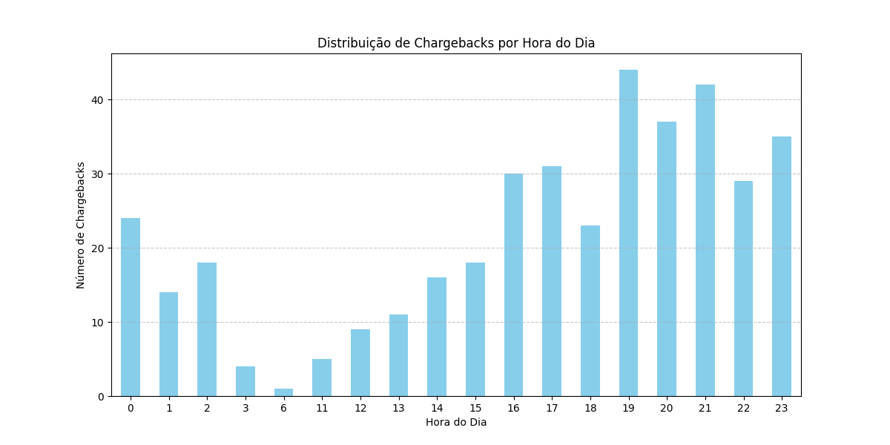

### Análise de Dispositivos
Arquivo: `8.py` - Número de dispositivos únicos e frequência de transações por dispositivo.

Há 1.996 dispositivos únicos registrados nos dados, e 177 dispositivos estão associados a mais de uma transação.

### Dispositivos x Chargeback
Arquivo: `9.py` - Análise dos chargebacks por dispositivo revela uma variação considerável na frequência de chargebacks entre dispositivos.

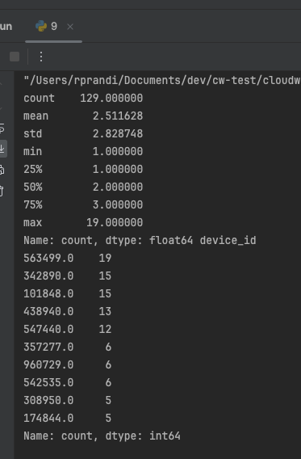

A análise dos chargebacks por dispositivo revela que:

    Número médio de chargebacks por dispositivo: aproximadamente 2.51
    Desvio padrão: 2.83, indicando uma variação considerável na frequência de chargebacks entre os dispositivos.
    Máximo de chargebacks para um único dispositivo: 19

Os dispositivos mais problemáticos, com o maior número de chargebacks, incluem dispositivos como o com ID 563499 (19 chargebacks) e os IDs 342890 e 101848 (ambos com 15 chargebacks).

### Análise de Números de Cartão
Arquivo: `10.py` - Detalhamento dos cartões com maior número de transações.

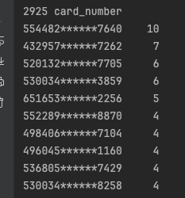

Há 2.925 cartões únicos registrados nos dados. O cartão com o número finalizado em 7640 possui o maior número de transações, com um total de 10. Outros cartões, como os finalizados em 7262, 7705, e 3859, também têm um número relativamente alto de transações associadas a eles.

### Número de Cartão x Chargeback
Arquivo: `11.py` - Análise de chargebacks por número de cartão.

    Média de chargebacks por cartão: cerca de 1.43
    Desvio padrão: 0.95, indicando uma certa variação na frequência de chargebacks entre os cartões.
    Máximo de chargebacks para um único cartão: 10, que é para o cartão finalizado em 7640.

Os cartões com maior número de chargebacks incluem o mesmo cartão com o maior número de transações (finalizado em 7640), além de outros cartões como os finalizados em 3859 e 2256.

Esses resultados podem indicar cartões que são repetidamente alvo de fraude ou disputas, sugerindo a necessidade de investigação detalhada ou medidas preventivas adicionais para esses números específicos.

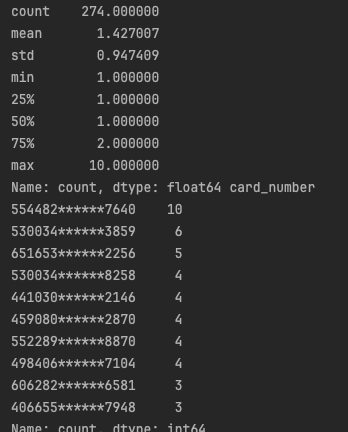

## Conclusão
Esta análise revelou padrões e tendências importantes dentro dos dados de transações.
Os dispositivos com maior número de chargebacks incluem os com IDs 563499, 342890, e 101848, e o cartão de número finalizado em 7640 destacou-se com o maior número de chargebacks. 
A detecção desses padrões sugere a necessidade de medidas preventivas e investigações detalhadas para mitigar riscos futuros e melhorar a segurança das transações.

## Bônus 1: Algoritmos de Machine Learning

### KNN (K-Nearest Neighbors)

Arquivo: `12.py` - Implementação do algoritmo KNN para classificação de transações com e sem chargeback.

O python possui libs como a scikit-learn, pandas, numpy, etc. que facilitam a implementação de algoritmos de machine learning.

O escopo dessa demonstração não inclue implementar na mão algumas etapas clássicas de um projeto de machine learning, como:
- Prepare os dados: limpeza, normalização, etc.
- Divida os dados em treino e teste.
- Implementação
- Avaliaçào (métricas de avaliação, como acurácia, precisão, recall, etc.)

Vamos apenas utilizar o algoritmo da lib e analisar.

É importante notar que os dados podem não fazer sentido para este algoritmo. Por exemplo, ser vizinho em device_id ou número de cartão não significa que as transações são similares.

mas fazer fazer a análise para fins de demonstração.

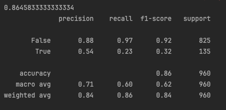

O modelo KNN foi aplicado alcançando uma precisão geral de 86.46%. 

- Precisão: 54% para as transações verdadeiras (True) e 88% para as transações falsas (False).
- Recall: 23% para as transações verdadeiras e 97% para as transações falsas.
- F1-Score: 32% para as transações verdadeiras e 92% para as transações falsas.

## Outros Dados Potenciais para Enriquecimento da Análise
- Dados de Comportamento
  - Frequência de login, IP, GPS onde as transações foram feitas.
- Dados mais Detalhados do Dispositivo
  - Além do device ID, poderíamos ter informações sobre sistema operacional, versão, navegador, se está jailbroken ou root.
- Mais Detalhes sobre o Comerciante
  - CID, histórico de transações, média de transações, localização GPS.
- Dados Biométricos
  - Reconhecimento de dedos ou face ID, quando aplicável.
- Dados de Rede
  - Uso de VPN, proxy, se o Wi-Fi é público.
- Dados mais Específicos da Transação
  - Tempo de processamento, número de tentativas até a aceitação, se foram utilizados muitos cartões.
- Dados de Terceiros
  - Informações sobre fraudes conhecidas, blacklist de cartões, score de crédito.
