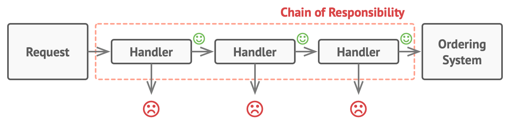
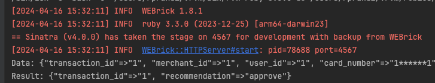

# Projeto de Servidor de Transações

Este documento descreve a configuração e funcionamento do servidor de transações que utiliza o padrão de design Chain of Responsibility para validar transações com base em várias regras de negócio.

## Índice
1. [Requisitos](#requisitos)
2. [Como Executar](#como-executar)
3. [Descrição do Endpoint](#descrição-do-endpoint)
4. [Detalhes de Implementação](#detalhes-de-implementação)
5. [Segurança](#segurança)
6. [Executando Testes](#executando-testes)

## Requisitos
- **Ruby**: Necessário para executar o código Ruby.
- **Bundler**: Gerenciador de dependências do Ruby.

## Como Executar
Para executar o aplicativo, siga estes passos:

```bash
bundle install  # Instala as dependências
cd task 3       # Entra na pasta do projeto
ruby app.rb     # Inicia o servidor
```

## Descrição do Endpoint

Para este exercício, precisamos criar um endpoint que recebe dados de transação como abaixo:

```json
{
  "transaction_id" : 2342357,
  "merchant_id" : 29744,
  "user_id" : 97051,
  "card_number" : "434505******9116",
  "transaction_date" : "2019-11-31T23:16:32.812632",
  "transaction_amount" : 373,
  "device_id" : 285475
}
```

E retorna se está aprovado ou não, por exemplo:
```json
{ 
  "transaction_id" : 2342357,
  "recommendation" : "approve"
}
```

## Detalhes de Implementação

Para criar este servidor, utilizei o padrão de projeto Chain of Responsibility


(foto do Refactoring Guru - no caso deles, é utilizado Ordering System. No nosso caso, considere que a saída é uma resposta final de recomendação)

Normalmente o padrão de projeto Chain of Responsibility é utilizado para evitar acoplamento entre classes, pois cada classe que encapsula uma regra de negócio não precisa saber da existência de outras classes que também encapsulam regras de negócio.
Na imagem acima, Há uma classe que encapsula cada regra de negócio que pode negar uma transação e caso nenhuma classe negue, a transação é validada com sucesso.

A Chain of Responsability clássica é implementada utilizando interfaces e handlers.

No caso deste projeto, eu decidi implementar usando os Mixins do Ruby, pois acredito que a implementação fica mais limpa e fácil de entender. Além disso, cada módulo fica desacoplado.

Cada módulo com uma regra de negócio se registra no FraudHandler ao ser incluso, como abaixo:
```ruby
module TimeBlockRule
  HOURS_BLOCKED = [ 19 ]  # in this example, we block transactions between 7pm and 8pm

  def self.included(base)
    base.register_validation_method(method(:call))
  end

  def self.call(request, history)
    if is_transaction_in_blocked_window?(request)
      true
    else
      nil
    end
  end

  def self.is_transaction_in_blocked_window?(request)
      transaction_time = Time.parse(request["transaction_date"]).hour
      HOURS_BLOCKED.include?(transaction_time)
  end
end
```

E o FraudHandler execuda a cadeia em seguida, sem precisar de herança para executar

````ruby
class FraudHandler
  @validation_methods = []

  class << self
    attr_reader :validation_methods

    def register_validation_method(method)
      @validation_methods << method
    end
  end

  include DeviceBlocklist
  # ... qualquer outro módulo que você queira adicionar de validacao
  include HighAmountRule

  def handle(request, history)
    self.class.validation_methods.each do |validation_method|
      result = validation_method.call(request, history)
      return { "transaction_id" => request["transaction_id"], "recommendation" =>  "deny" } if result
    end

    { "transaction_id" => request["transaction_id"], "recommendation" => "approve" }
  end
end
````

Para expor esse handler, criei uma aplicação Sinatra, que é um framework web para Ruby, que é muito simples de usar e muito poderoso. 

Para segurança, apesar de não ser o foco, é necessário enviar o header `TOKEN` com o valor `cloudwalk` . O token está setado em `.env`

Uma chamada exemplo está em `transactions_request.http`:
````http request
POST http://0.0.0.0:4567/transaction
Content-Type: application/json
TOKEN: cloudwalk

{
  "transaction_id" : "1",
  "merchant_id" : "1",
  "user_id" : "1",
  "card_number" : "1******1",
  "transaction_date" : "2019-11-31T23:16:32.812632",
  "transaction_amount" : "1",
  "device_id" : "1"
}
````
Para cada validador, eu tenho acesso ao CSV de fraude, que é um histórico de transações que foram negadas. O modelo está em `./domain/transaction.rb` e é utilizado em cada módulo de validação.

Para rodar o projeto, basta rodar `bundle install` e `ruby app.rb` e fazer uma requisição como acima.

Aqui está um exemplo do servidor rodando. 



O projeto tinha 3 requisitos:

- Rejeitar transações se o cliente estiver tentando muitas transacoes em seguida
- Rejeitar transações acima de um certo valor em um dado período
- Rejeitar transações se o usuário teve um chargeback antes

Para o item 1 eu adiciono cada tentativa (chamada ao endpoint) na lista de transações na memória. resete o servidor para limpar a lista.

Além disso, adicionei algumas regras próprias com base na task 2 (como blocklist de device e cartão) e uma regra de horário (não aceitar transações entre 19h e 20h pois é o horário com mais chargebacks).

Estas regras estão implementadas em `./fraud/*_rule.rb`

Sobre Latência, estou utilizando o csv em memória e não estou utilizando banco de dados, então a latência é muito baixa.

## Segurança

Sobre segurança, eu estou utilizando um token para autenticação, mas não estou utilizando HTTPS, então a comunicação não é segura (está fora do escopo) porém é necessário enviar um token para acessar o endpoint.

## Executando Testes

Rode `rspec` na raiz para rodar alguns testes básicos -- o caminho feliz onde a transacão é aprovada e um teste para cada validador falhar